# Tài Liệu Triển Khai Face Recognition trên AnyCloud39AV100 NNE SDK

**Đơn vị:** Camera AI Team  
**Phiên bản:** v1.0  
**Ngày:** 2026-03-16  
**Trạng thái:** ✅ Phase 1 (Model → .bin) Hoàn thành — 🔄 Phase 2 (Deployment) Đang triển khai

---

## Mục Lục

1. [Tổng quan hệ thống](#1-tổng-quan-hệ-thống)
2. [Kiến trúc pipeline tổng thể](#2-kiến-trúc-pipeline-tổng-thể)
3. [NNE Compile Toolchain — Đã hoàn thành](#3-nne-compile-toolchain--đã-hoàn-thành)
4. [Kiến trúc NNE Runtime trên Board](#4-kiến-trúc-nne-runtime-trên-board)
5. [NNE API Call Flow](#5-nne-api-call-flow)
6. [Face Recognition Inference Pipeline](#6-face-recognition-inference-pipeline)
7. [Feature Database Design](#7-feature-database-design)
8. [Tích hợp Camera Pipeline](#8-tích-hợp-camera-pipeline)
9. [Kế hoạch Testing & Validation](#9-kế-hoạch-testing--validation)
10. [Kế hoạch triển khai (Roadmap)](#10-kế-hoạch-triển-khai-roadmap)

---

## 1. Tổng quan hệ thống

### 1.1 Mục tiêu

Triển khai hệ thống **Face Recognition real-time** trên camera AI sử dụng chip **AnyCloud39AV100** của Anyka. Hệ thống phải:

- Nhận diện khuôn mặt từ luồng video camera (real-time)
- Chạy inference neural network trực tiếp trên **NPU** (Neural Processing Unit) của chip
- Đạt tốc độ xử lý phù hợp cho ứng dụng nhúng (mục tiêu ≥ 10 FPS)
- Tiêu thụ tài nguyên tối thiểu (RAM, CPU)

### 1.2 Thành phần hệ thống

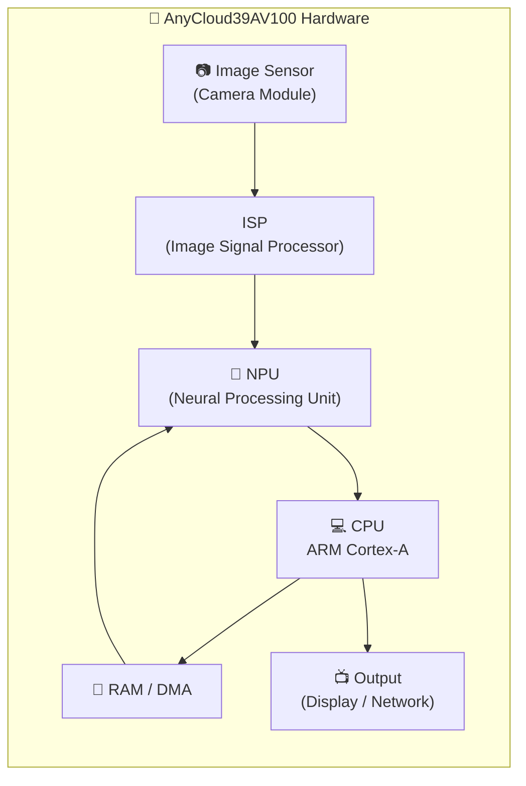

### 1.3 Trạng thái hiện tại

| Giai đoạn       | Công việc                                           | Trạng thái   |
| --------------- | --------------------------------------------------- | ------------ |
| **Training**    | Train MobileFaceNet/MobileNetV1 trên custom dataset | ✅ Hoàn thành |
| **ONNX Export** | Convert PyTorch → ONNX                              | ✅ Hoàn thành |
| **NNE Compile** | ONNX → Quantize → `.bin` (NNE binary)               | ✅ Hoàn thành |
| **Feature DB**  | Xây dựng embedding database cho board               | 🔲 Chưa làm   |
| **C Inference** | Viết C code gọi NNE API, preprocess, postprocess    | 🔲 Chưa làm   |
| **Face Detect** | Tích hợp face detection vào pipeline                | 🔲 Chưa làm   |
| **Integration** | Ghép toàn bộ pipeline với camera                    | 🔲 Chưa làm   |
| **Testing**     | Validate accuracy, benchmark FPS                    | 🔲 Chưa làm   |

---

## 2. Kiến trúc Pipeline Tổng Thể

Toàn bộ pipeline chia làm **2 luồng chính**: luồng offline (chạy trên PC) và luồng online (chạy trên board).

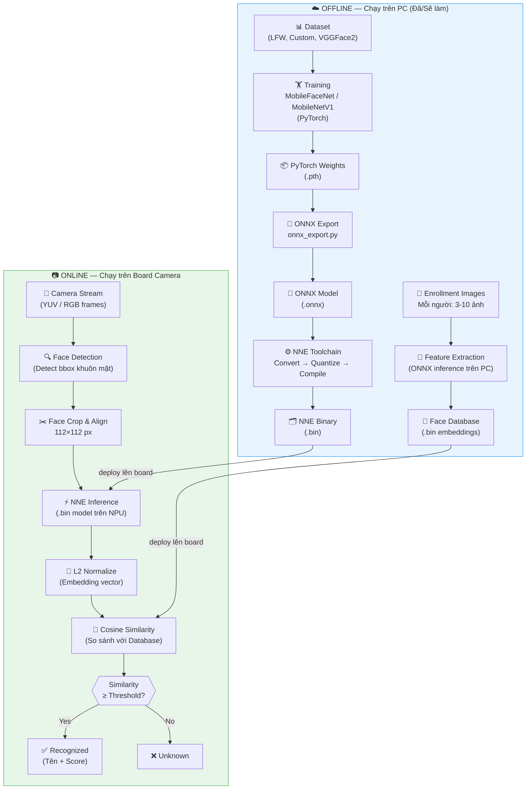

---

## 3. NNE Compile Toolchain — Đã Hoàn Thành

### 3.1 Các bước đã làm

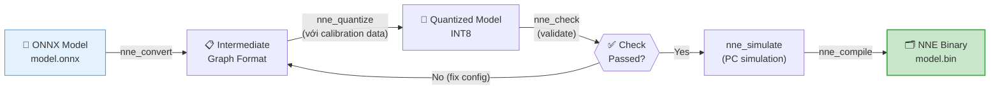

### 3.2 Thông tin quan trọng của file `.bin`

File `.bin` đã compile chứa **struct header NNE_MODEL_HEADER** gồm:

| Trường                          | Ý nghĩa                             | Lưu ý khi dùng                         |
| ------------------------------- | ----------------------------------- | -------------------------------------- |
| `input_w`, `input_h`, `input_c` | Kích thước input (thường 112×112×3) | Preprocessing phải đúng kích thước này |
| `input_color`                   | RGB / BGR / YUV                     | Feed đúng color space                  |
| `input_norm`                    | Normalize mode (mean/std)           | **BẮT BUỘC khớp với C code**           |
| `quan_method`                   | INT8 / FP16                         | Biết để debug accuracy                 |
| Output blob info                | Shape tensor đầu ra                 | Dùng để đọc embedding vector           |

> ⚠️ **Điều quan trọng nhất:** Các thông số `input_norm` (mean, scale) trong config quantize khi compile `.bin` **phải được hardcode y hệt** vào C preprocessing code. Nếu sai → embedding sai hoàn toàn.

---

## 4. Kiến trúc NNE Runtime trên Board

### 4.1 Các thư viện NNE SDK

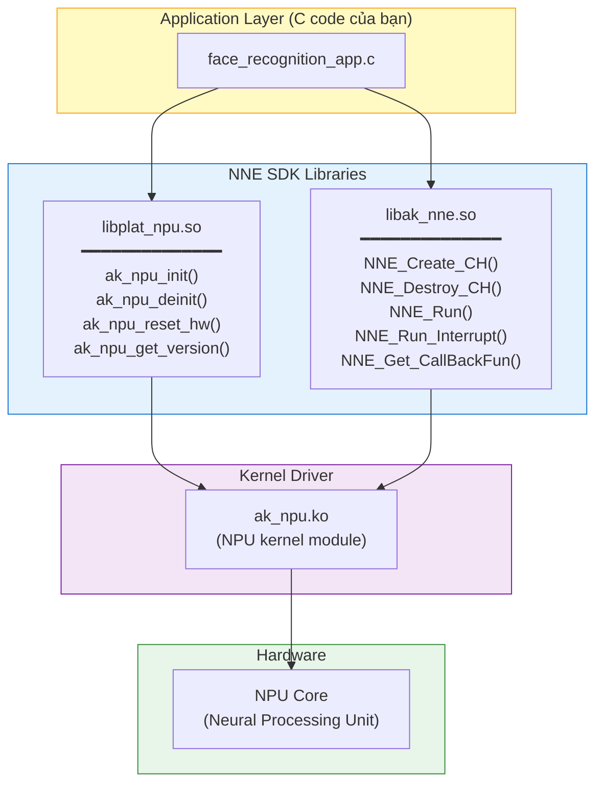

### 4.2 Memory Layout khi Inference

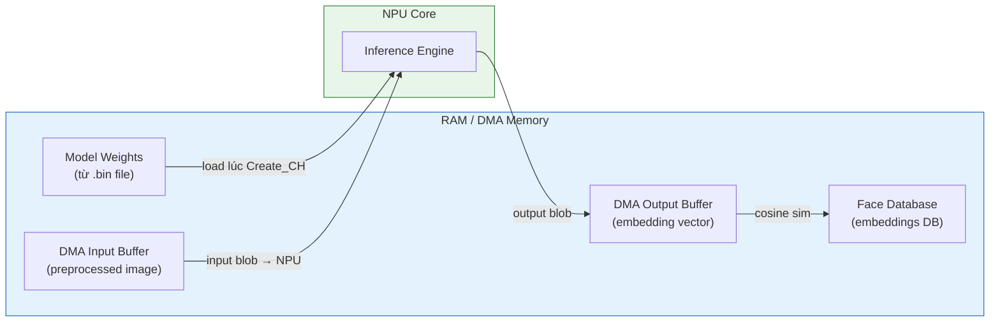

---

## 5. NNE API Call Flow

### 5.1 Luồng gọi API đầy đủ (theo tài liệu NNE API参考 V1.0.4)

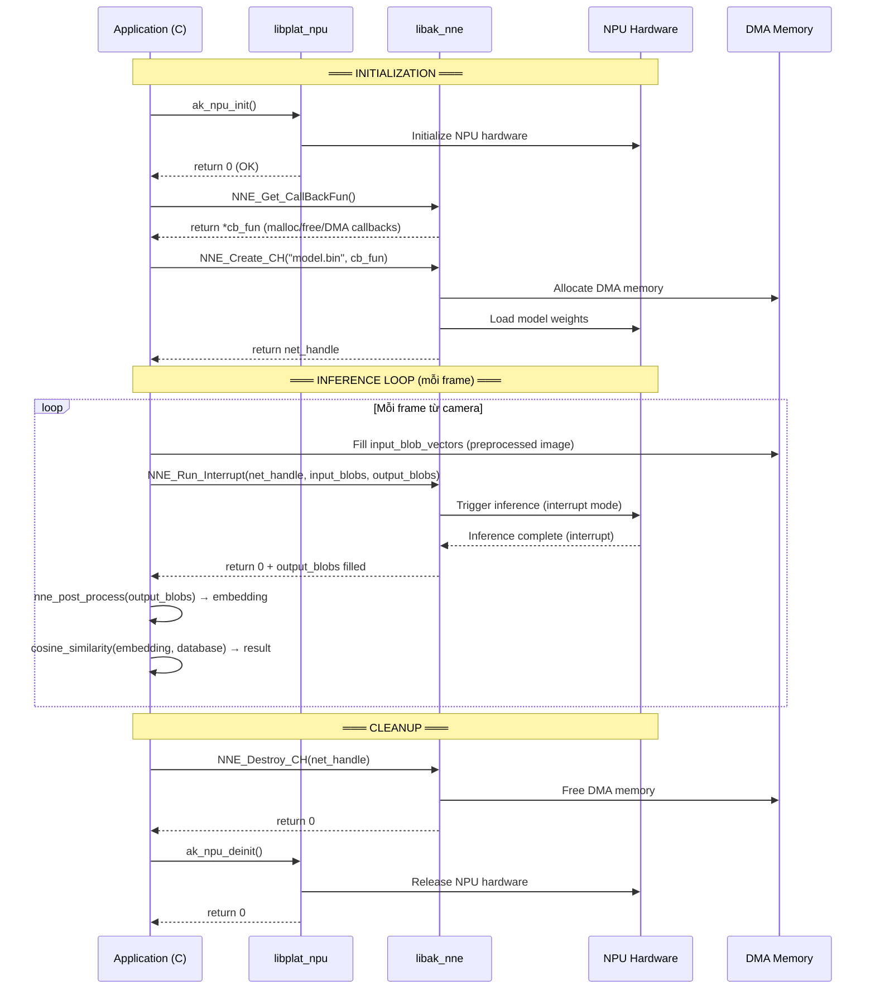

### 5.2 Quan hệ giữa NNE_Run và NNE_Run_Interrupt

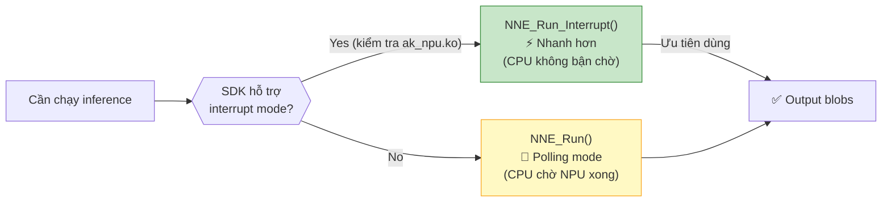

---

## 6. Face Recognition Inference Pipeline

### 6.1 Full inference pipeline mỗi frame

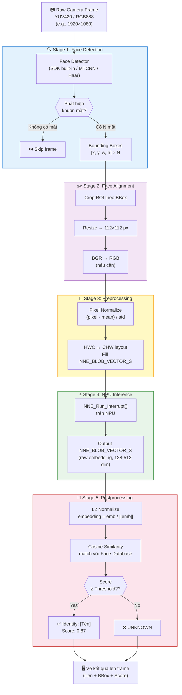

### 6.2 Chi tiết Preprocessing — Tại sao quan trọng

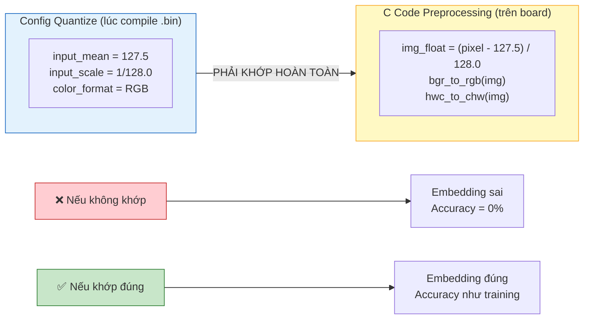

---

## 7. Feature Database Design

### 7.1 Cách xây dựng Face Database

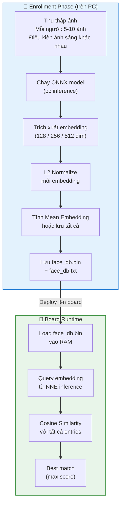

### 7.2 Cấu trúc Face Database

```
face_database/
├── face_db.bin          ← Float32 array [N_persons × embed_dim]
├── face_db.txt          ← Danh sách tên, 1 dòng / người
└── face_db_meta.json    ← Metadata: embed_dim, threshold, model_version
```

**Ví dụ `face_db_meta.json`:**
```json
{
  "model_version": "mobilefacenet_v1",
  "embed_dim": 128,
  "n_persons": 50,
  "threshold": 0.50,
  "normalize": "l2",
  "created_date": "2026-03-16"
}
```

### 7.3 Chiến lược lưu embedding

| Chiến lược                            | Ưu điểm    | Nhược điểm               | Khuyến nghị                   |
| ------------------------------------- | ---------- | ------------------------ | ----------------------------- |
| **Mean embedding** (trung bình N ảnh) | Nhỏ, nhanh | Mất thông tin biến thiên | ✅ Bắt đầu với cái này         |
| **Lưu tất cả** (N ảnh × embed)        | Robust hơn | Tốn RAM, chậm hơn        | Khi cần accuracy cao          |
| **Clustering** (đại diện cụm)         | Cân bằng   | Phức tạp hơn             | Khi database lớn (>100 người) |

---

## 8. Tích hợp Camera Pipeline

### 8.1 Kiến trúc module tổng thể trên board

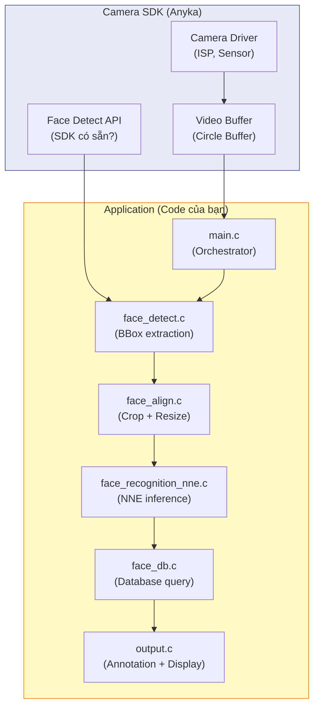

### 8.2 Quyết định Face Detection

Trước khi viết code, cần quyết định dùng phương án nào:

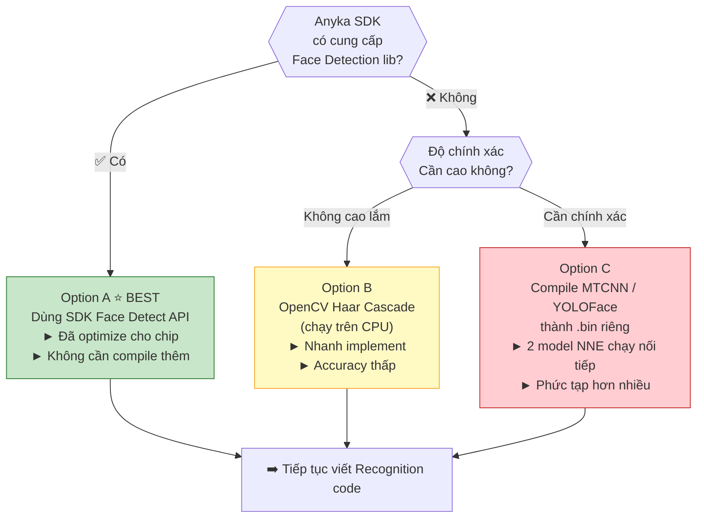

### 8.3 Cấu trúc thư mục project trên board

```
face_recognition_app/
│
├── CMakeLists.txt               ← Build config (cross-compile)
│
├── src/
│   ├── main.c                   ← Entry point, camera loop
│   ├── face_detect.c            ← Face detection wrapper
│   ├── face_align.c             ← Crop, resize, color convert
│   ├── face_recognition_nne.c   ← NNE API inference
│   └── face_db.c                ← Load database, cosine search
│
├── include/
│   ├── face_detect.h
│   ├── face_align.h
│   ├── face_recognition_nne.h
│   └── face_db.h
│
├── models/
│   └── face_recognition.bin     ← Model .bin đã compile
│
├── database/
│   ├── face_db.bin              ← Embeddings float32
│   ├── face_db.txt              ← Danh sách tên
│   └── face_db_meta.json        ← Metadata
│
└── libs/                        ← NNE SDK (từ vendor)
    ├── include/
    │   ├── ak_npu.h
    │   └── ak_nne_common.h
    └── lib/
        ├── libplat_npu.so
        └── libak_nne.so
```

---

## 9. Kế hoạch Testing & Validation

### 9.1 Strategy kiểm tra từng tầng

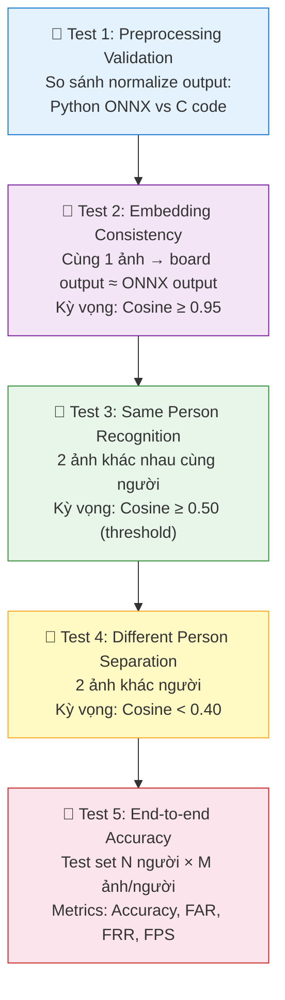

### 9.2 Metrics cần đo

| Metric                      | Công thức                                 | Mục tiêu |
| --------------------------- | ----------------------------------------- | -------- |
| **Accuracy**                | Đúng / Tổng                               | ≥ 95%    |
| **FAR** (False Accept Rate) | Unknown bị nhận sai / Total Unknown       | ≤ 1%     |
| **FRR** (False Reject Rate) | Người quen bị từ chối / Total Known       | ≤ 5%     |
| **Inference Latency**       | Thời gian 1 lần NNE_Run                   | ≤ 50ms   |
| **End-to-end FPS**          | Frame / giây (detect + align + recognize) | ≥ 10 FPS |

### 9.3 Quy trình validate preprocessing

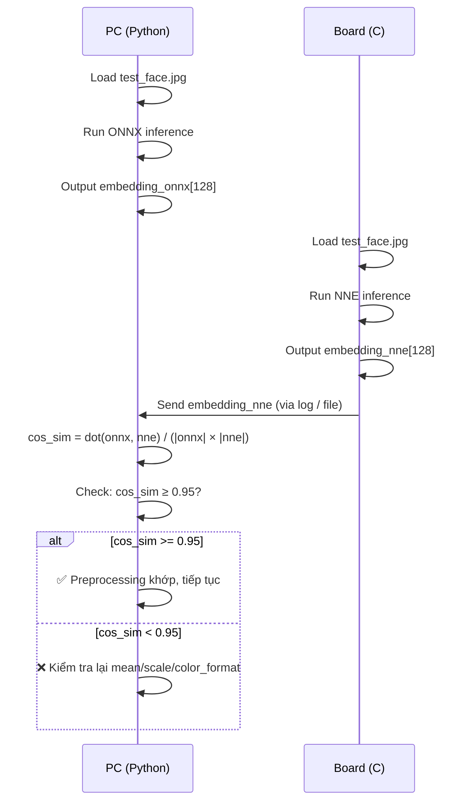

---

## 10. Kế hoạch Triển Khai (Roadmap)

### 10.1 Các giai đoạn công việc

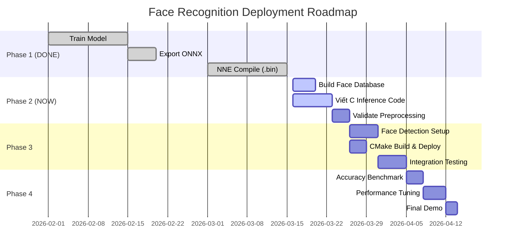

### 10.2 Thứ tự ưu tiên công việc ngay bây giờ

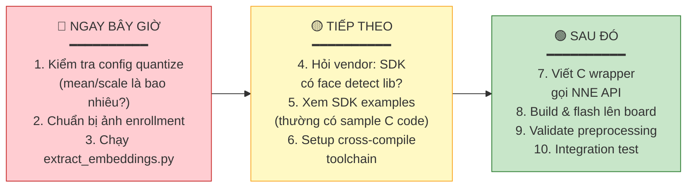

### 10.3 Checklist chi tiết

#### ✅ Đã hoàn thành
- [x] Train model `MobileFaceNet` / `MobileNetV1` trên custom dataset
- [x] Export sang ONNX (`onnx_export.py`)
- [x] Verify ONNX accuracy (`evaluate_onnx.py`)
- [x] Compile ONNX → `.bin` bằng NNE Toolchain

#### 🔲 Phase 2 — Feature Database (PC)
- [ ] Chuẩn bị thư mục ảnh enrollment: `data/enrollment/<tên>/*.jpg`
- [ ] Viết `extract_embeddings.py` — inference ONNX → lưu embeddings
- [ ] Viết `db_to_binary.py` — lưu embeddings sang `face_db.bin`
- [ ] Verify cosine similarity giữa ảnh cùng người (kỳ vọng ≥ 0.5)
- [ ] Copy `face_db.bin` + `face_db.txt` lên board

#### 🔲 Phase 2 — C Inference Code (Board)
- [ ] **Xác nhận normalize config** từ file config quantize `.cfg`/`.json`
- [ ] Kiểm tra SDK có sẵn face detection library không
- [ ] Xem qua code example trong SDK của vendor
- [ ] Viết `face_recognition_nne.c` với đúng NNE API call flow
- [ ] Viết `face_db.c` — load `.bin` database và cosine search
- [ ] Setup `CMakeLists.txt` với cross-compile toolchain

#### 🔲 Phase 3 — Build & Integration
- [ ] Build thành công: `cmake` + `make` (không lỗi)
- [ ] Copy binary lên board và chạy test 1 ảnh tĩnh
- [ ] Validate: embedding board ≈ embedding ONNX (cosine ≥ 0.95)
- [ ] Tích hợp với camera loop

#### 🔲 Phase 4 — Testing & Benchmark
- [ ] Test accuracy: ≥ 95%
- [ ] Test FAR: ≤ 1%
- [ ] Benchmark inference latency: ≤ 50ms/frame
- [ ] Benchmark FPS end-to-end: ≥ 10 FPS
- [ ] Demo final

---

## Phụ lục: Câu hỏi cần hỏi Vendor (Anyka)

Trước khi triển khai, nên xác nhận những điểm sau với vendor:

| #   | Câu hỏi                                                                       | Tại sao quan trọng                 |
| --- | ----------------------------------------------------------------------------- | ---------------------------------- |
| 1   | SDK có cung cấp **Face Detection library** không?                             | Quyết định approach face detection |
| 2   | Có **C code example** nào dùng NNE API không?                                 | Tiết kiệm thời gian implement      |
| 3   | Input tensor phải dùng **DMA buffer** hay regular malloc?                     | Ảnh hưởng đến `PhyAddr` trong blob |
| 4   | Có hỗ trợ **interrupt mode** (`NNE_Run_Interrupt`) trên version SDK hiện tại? | `NNE_Run_Interrupt` nhanh hơn      |
| 5   | Model `.bin` có thể load từ **SD card / flash** không?                        | Xác định đường dẫn model           |
| 6   | Board có bao nhiêu **RAM / DMA memory** khả dụng?                             | Ảnh hưởng đến database size        |

---

*Tài liệu này được sinh ra dựa trên: `AnyCloud39AV100 NNE API参考_V1.0.4.pdf`, `AnyCloud39AV100 NNE使用示例_V1.0.5.pdf`, `AnyCloud39AV100 NNE网络移植编程手册_V1.0.5.pdf` và cấu trúc repo hiện tại.*
